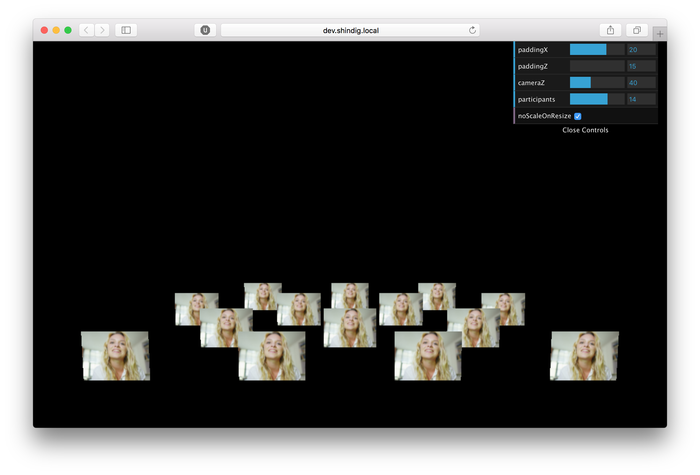

# Grid Prototype


An example and tool to help define layout specification and create code logic required for suggested grid layout in UX documents. Built with Javascript using [THREE JS](https://threejs.org/docs/index.html#Manual/Introduction/Creating_a_scene)  
  


###Grid Rows 

Rows alternate from odd and even numbers to get the best visibility for each avatar, and also to form a more organic pattern to simulate a crowd to avoid military style rows. The FIRST front most row in the grid should ALWAYS be an even number to leave space for the users avatar that will be anchored at the bottom center of the screen. 
The grid is currently set to 4 rows with a default of 14 Participants that can be adjusted with the UI slider to a maximum of 20;  


###Grid Pattern Configuration 

The pattern configurations of the grid are stored in a Dictionary (hash table) where the key represents the number of participants and the corresponding object is an Array of integers where; 

 • the length of the Array determines the number of rows in the grid  
 • and the integer value determines how many items occupy each row  
 • the values in the Array will always be alternating odd and even numbers for the desired effect  
 • the sum of the integer values in each Array should always total the integer value of its corresponding key in the table.  
 

```javascript
four_row_matrix_config = {
        "1":[0, 1, 0, 0], 
        "2":[2, 0, 0, 0],  
		"3":[2, 1, 0, 0],
		"4":[4, 0, 0, 0],  
		"5":[4, 1, 0, 0],  
		"6":[4, 0, 2, 0],  
		"7":[4, 3, 0, 0],  
		"8":[4, 1, 2, 1],  
		"9":[2, 3, 4, 0],  
		"10":[4, 3, 2, 1],  
		"11":[4, 3, 4, 0],  
		"12":[4, 3, 4, 1],  
		"13":[4, 3, 2, 3],  
		"14":[4, 3, 4, 3],  
		"15":[4, 5, 6, 0],  
		"16":[4, 5, 6, 1],  
		"17":[6, 5, 6, 0],  
		"18":[6, 5, 4, 3],  
		"19":[6, 7, 6, 0],  
		"20":[6, 5, 6, 3],  
		"21":[6, 7, 8, 0],  
		"22":[6, 7, 8, 1]  
	};  
```  

More of these tables can be created to apply configurations for various scenarios where you might need the grid to be reduced to two rows or have another configuration for different window size. 
  

###Row Spacing  

The spacing between each row has been set to the width of an avatar. This should be the minimum padding space between rows for ideal visibility of each avatar in the row behind.  
Should the default size of the avatar width change so should the minimum row spacing change to match.  

Row Spacing = Avatar WIDTH
  
  
###Avatars 

Avatar currently set to **4:3** aspect ratio to match majority of web cams. Any 16:9 web cams can simply be cropped. 
The width is set to a reasonable width to comply with the camera positioning along the Z axis and insure that the avatar is displayed at a reasonable size for UI interactions.

Current default avatar dimensions 

Avatar **WIDTH**  = 15px  
Avatar **HEIGHT** = WIDTH * 0.75 (4:3 aspect ratio)


###Window Resizing
On window resize, by default THREE JS adjust the camera field of view (FOV) to scale the objects in the scene.  
This is good for making sure the entire grid is visible at all times however it could also make the objects too small to view and to interact with. The FOV scaling on window resize can be be eliminated to present another alternative to make the padding between avatars correspond to window resize width to ensure they are displayed within the bounds of the window width.  
Most likely a combination of the two approaches is needed with logic to determine when and which approach is used.

You can toggle window resize scaling on/off in the UI controls in the top left. (The auto padding on window resize when scaling is off has not been implemented. You can use the x padding slider to adjust padding)

#Docs
##GridMatrix
###- Constructor

**```GridMatrix( size, rowPadding, itemWidth )```**  
  

- **```size```**  
initial number if items to create grid  

- **```rowPadding```**  
initial spacing between rows in grid  

- **```itemWidth```**  
initial width of items in grid  

###- Properties  
##### ```.size```  
The total number of items used to make up the grid.  
  
##### ```.matrix```  
An array of integers where the length of the array is how many rows make up the grid. And the value of the integer is how many items are in a row. Multiple grid matrix are created for various grid patterns and layouts.  
  
##### ```.rowsCount```  
Total number of rows in the grid.  
  
##### ```.rows```  
An Array of Row Objects.  
  
##### ```.firstRowZpos```  
The .x  position of the Row. (.x positions of each item in the row are calculated based on this coordinate.)
  
##### ```.padding```  
Space in pixels between each item.  
  
##### ```.rowZpadding```  
Space in pixels between each row.  
  
###- Methods  
  
##### ```.updateMatrix ( newSize )```   
Updates the current matrix to a new one based on the argument passed into the ```size``` parameter.  

##### ```.updateItemSize ( newItemWidth )```  
Update the size of the items in the grid based on the argument passed into the ```newItemWidth``` parameter. 

##### ```.createGridRows ( rowItemPaddding, itemWidth )```  
Called at initialization to create the initial grid row objects.  
  
##### ```.populateGrid ()```  
Populates grid with items (3D Plane meshes created with THREE JS)  

##### ```.setRowPadding ( zPadding )```  
Set row padding between rows to the argument for the ```zPadding``` parameter. 
Currently the padding between the camera and the first row stays the same but you can uncomment 
this line  
```this.firstRowZpos = (this.padding * -1)```  
on line 109 to update the padding between the 1st row and the camera. 

##### ```.setMatrix ( size )```  
Set the size (number of items) in the grid to the argument for the ```size``` parameter. 
  
##Row  
The Row object is an extension of an Array object and has custom properties and methods for managing items that are contained in a row.  

###- Constructor  

**```Row( length, padding, itemWidth, zPos )```**  

- **```length```**  
Number if items in the Row  
  
- **```padding```**  
Spacing between items in the row  
  
- **```itemWidth```**  
Width of items in row. Used to calculate each items .x position   
  
- **```zPos```**  
The .z position for the Row object.   


###- Properties  

##### ```.length```  
Number if items in the Row  
  
##### ```.padding```  
Spacing between items in the row  

##### ```.itemWidth```  
Width of items in row. Used to calculate each items .x position  

##### ```.zPos```  
The .z position for the Row object  

##### ```.xPos```  
The .x position for the Row object 
  
####- Methods  

##### ```.addItemAtIndex( index )```  
Add an new item into a Row  
  
##### ```.removeItemAtIndex( index )```  
Remove item from Row  
  
##### ```.update()```  
Update the row after any changes   
  
##### ```.setXpos()```  
Set the .x position for the Row (.x position for the Row will also be the same as the .x position for the first item in each row)    


